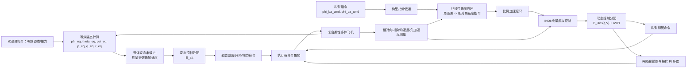
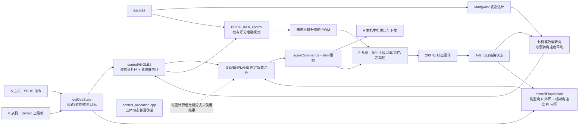

# 复合柔性多体飞机控制框架与控制律分析

> 历史分析归档：本文保留模块拆分前的代码快照、行号和验证记录。文中的“当前代码”指分析时的版本；现行配置、模块位置和输出行为见 [架构说明](../architecture.md) 与 [固件指南](../firmware-guide.md)。动态分配调用现已注释，MT6701 使用 Wire1，执行器已有统一锁定与最终限幅。

## 1. 分析范围与结论

本文综合以下三类证据：

- Zhu、Zhou、Wang，*Aerodynamics-Driven Morphing Control and Flight Test for Compound Flexible Multibody Aircraft*，Journal of Guidance, Control, and Dynamics, 2025（仓库 PDF，共 13 页；重点为 PDF 第 5–8 页）。
- `REPOSITORY_KNOWLEDGE.md` 的仓库知识。
- 当前源码 `src/main.cpp` 与 `src/control_allocation.cpp`。

最重要的结论是：**论文框架与当前代码只部分一致**。

1. 二者都采用“整体等效姿态控制 + 相对构型控制”并行、最后叠加到执行器的思想。
2. 论文的构型回路是“非线性外环 + INDI + 实时更新的 IWPI 约束控制分配”；当前七机代码的构型回路实际是“线性 P 外环 + PI 速率内环 + 固定增益混控”。
3. `control_allocation.cpp` 实现的是五体、四铰链、十个副翼的普通 SVD 伪逆模型，不是论文的饱和感知 IWPI；并且在当前 `SEVENPLANE` 分支中，它的输出没有接入实际七机舵面命令。
4. 当前启用的 `TESTINDI` 是**单机俯仰升降舵 INDI**，不是论文用于相对弯折角的构型 INDI。
5. 当前编译身份为 F 从机。F 机主要闭环计算本机升降舵；副翼、油门和方向舵主要执行上级串口分配结果。

---

## 2. 论文提出的控制框架

论文强调的设计逻辑如下（PDF 第 5–8 页）：

- 构型回路优先级更高、动作更激进，但稳定裕度较弱，因此使用 INDI。
- 整体姿态回路控制复合体的“等效姿态”，使用常规串级 PI。
- 两个回路在逻辑上并行，并不意味着动力学完全解耦；其输出在执行器端相加。
- 控制效能随构型和飞行状态改变，因此应在每个计算周期更新。
- 论文将全量 `10×12` 分配问题简化为构型导向的 `3×6` 问题，并用 IWPI 处理舵面饱和、扩大可达加速度集。

### 2.1 论文的构型 INDI 控制律

令相对弯折角误差为

$$
e_{angle}=\phi_{ba,ca}^{cmd,f}-\phi_{ba,ca}^{mea},
$$

其中上标 `cmd,f` 表示构型指令先经过低通。论文称角度外环为 logarithmic controller，其给出的障碍型变增益形式为（式 29）：

$$
w_c=\frac{K_e e_{angle}}{b^2-e_{angle}^2},\qquad |e_{angle}|<b.
$$

当误差接近边界 $b$ 时增益迅速增加，小误差时输出温和；工程实现必须在 $|e_{angle}|\to b$ 前做限幅。相对角速度误差再转为期望相对角加速度（式 28）：

$$
\dot w_c=K_w(w_c-w_m).
$$

INDI 使用上一周期虚拟输入 $v_f$ 和低通后的实测角加速度 $\dot w_m^f$ 更新本周期虚拟控制（式 27）：

$$
v_c=v_f+\dot w_c-\dot w_m^f.
$$

论文的带宽分离依据是：实测执行器特征频率约 $22\ rad/s$，最高构型模态约 $1.7\ rad/s$，因此在一个控制周期内可近似认为输入变化快于状态变化。最终副翼命令为（式 30）：

$$
\delta_{Aileron}=\operatorname{IWPI}\left(B_{3\times6}(q,V),v_c\right).
$$

### 2.2 论文的升降舵补偿律

每架单机的升降舵命令由副翼诱导俯仰力矩前馈与相对扭转反馈组成（式 19）：

$$
\delta_{e,i}=
\frac{C_{m\delta ail}}{C_{m\delta ele}}
\left(\delta_{ail,i}^{left}-\delta_{ail,i}^{right}\right)
+PI(\theta_{i,err}).
$$

第一项抵消副翼差动带来的附加俯仰力矩，第二项把相对扭转角压到 $0^\circ$。

### 2.3 论文的整体等效姿态律

对三机原型，等升力近似下的等效滚转角为（式 32）：

$$
\phi_{eq}=\arctan\frac{
\sin\phi_a+\sin(\phi_a+\phi_{ba})+\sin(\phi_a+\phi_{ca})}
{\cos\phi_a+\cos(\phi_a+\phi_{ba})+\cos(\phi_a+\phi_{ca})},
$$

且 $[\theta_{eq},\psi_{eq}]^T=[\theta_a,\psi_a]^T$。滚转和俯仰采用串级 PI，偏航采用速率 P（式 37）：

$$
\dot p_{eq}^{cmd}=k_{rp}^{1}\left[
\frac{e_\phi}{T_c^{1}}+k_i^{1}\int e_\phi dt-p_{eq}^{mea}
\right],
$$

$$
\dot q_{eq}^{cmd}=k_{rp}^{2}\left[
\frac{e_\theta}{T_c^{2}}+k_i^{2}\int e_\theta dt-q_{eq}^{mea}
\right],
$$

$$
\dot r_{eq}^{cmd}=k_{rp}^{3}(r_{eq}^{cmd}-r_{eq}^{mea}).
$$

期望等效角加速度再经等效姿态导向控制效能矩阵分配（式 38–39）：

$$
u_\delta=B_{eq}^{att}
[\dot p_{eq}^{cmd},\dot q_{eq}^{cmd},\dot r_{eq}^{cmd}]^T,
$$

$$
B_{eq}^{att}=E_a^{eq}
\left[M^{-1}\frac{\partial Q^*}{\partial u}\right]_{4-6\ rows}.
$$

### 2.4 论文 IWPI 的效果

普通伪逆最小化 $L_2$ 范数，而扩大可达加速度集更接近最小化最大舵偏（$L_\infty$）。论文报告：IWPI 在同一计算平台达到约 981–1061 Hz，而直接优化约为 6–7 Hz；通常两轮迭代即可取得主要收益。与简化后的普通 `B_3×6` 伪逆相比，可达加速度集面积增加 26.65%；与原始 `B_10×12` 基线相比增加约 4097%。

---

## 3. 当前代码实际控制结构

### 3.1 当前条件编译配置

当前宏为 `FPLANE + SEVENPLANE + TEAM + INTIMU + TESTINDI + expensive + ODD`，见 `main.cpp:397-432`。因此当前固件不是中央 A 主机，而是序列 `F-D-B-A-C-E-G` 的 F 从机。

### 3.2 500 Hz 主循环

名义控制周期为 2 ms。主要顺序为：

1. 计算 `dt`，读取 BMI088，Madgwick 解算姿态，差分并滤波得到角加速度。
2. 从上级帧或遥控器得到模式和目标。
3. 接收相邻/下游机体状态。
4. 根据模式运行整体姿态控制与构型控制。
5. 每圈调用动态控制分配计算，然后进入当前构型对应的混控分支。
6. 缩放为 PWM；有积分增稳时，俯仰 INDI 覆盖升降舵命令。
7. 输出本机执行器，向下转发命令、向上回传状态，记录日志。
8. 循环末尾更新 SBUS 并执行失效保护，再等待到 2 ms。

关键代码见 `main.cpp:1461-1872`。`loopRate(500)` 只能限制循环不快于 500 Hz；OLED、SD、串口打印、矩阵逆和 SVD 若超时，实际频率会降低。

---

## 4. 整体姿态控制律：`controlANGLE2()`

### 4.1 等效滚转状态

七机等效滚转角采用圆均值：

$$
\phi_{eq}=\arctan\left(
\frac{\sum_{i=A}^{G}\sin\phi_i}
     {\sum_{i=A}^{G}\cos\phi_i}
\right).
$$

七机等效滚转角速度采用算术平均：

$$
p_{eq}=\frac{1}{7}\sum_{i=A}^{G}p_i.
$$

实现见 `main.cpp:3465-3503,3571-3585`。这与论文等效滚转角的基本思想一致，但代码使用 `atan(y/x)` 而非 `atan2(y,x)`，跨象限时可能发生跳变。

### 4.2 姿态外环

滚转外环为：

$$
e_\phi=\phi_d-\phi_{eq},\qquad
\xi_\phi(k)=\operatorname{sat}_{45}\bigl(\xi_\phi(k-1)+e_\phi\Delta t\bigr),
$$

$$
p_d^0=K_{p\phi}e_\phi+i_{valid}K_{i\phi}\xi_\phi,
\qquad
p_d=\operatorname{LPF}_{B_\phi}\left[
\operatorname{sat}_{240}(30p_d^0)\right].
$$

俯仰外环为：

$$
e_\theta=\theta_d-\theta,
$$

$$
q_d^0=30\left(K_{p\theta}e_\theta+i_{valid}K_{i\theta}\xi_\theta\right),
$$

$$
q_d=
\operatorname{sat}_{240}\left[
\frac{q_d^0-r\sin\phi}
{\operatorname{constrain}(\cos\phi,0.5,1)}
\right].
$$

代码参数为：

$$
K_{p\phi}=0.25,\ K_{i\phi}=0,\quad
K_{p\theta}=0.12,\ K_{i\theta}=0,\quad
B_\phi=B_\theta=1.
$$

因此虽然有“有积分/无积分”模式，当前姿态**外环**积分增益实际为零。实现见 `main.cpp:941-962,3507-3567`。

### 4.3 角速度内环

滚转内环：

$$
e_p=p_d-p_{eq},
$$

$$
u_\phi=0.01\left[
K_{ff,p}p_d+K_{p,p}e_p+i_{valid}K_{i,p}\int e_pdt+K_{d,p}\dot e_p
\right].
$$

俯仰内环：

$$
e_q=q_d-q,
$$

$$
u_\theta=0.01\left[
K_{ff,q}q_d+K_{p,q}e_q+i_{valid}K_{i,q}\int e_qdt+K_{d,q}\dot e_q
\right].
$$

TEAM 参数为：

| 通道 | $K_{ff}$ | $K_p$ | $K_i$ | $K_d$ |
| --- | ---: | ---: | ---: | ---: |
| 滚转 | 0.12 | 0.15 | 0.10 | 0.0002 |
| 俯仰 | 0.20 | 0.11 | 0.10 | 0 |

偏航回路先加入协调转弯角速度：

$$
r_{turn}=\frac{180}{\pi}\frac{g}{V_{cruise}}
\tan\phi_d\cos\theta_d,
\qquad e_r=r_d-r_{turn}-r,
$$

$$
u_\psi=0.01\left[
K_{ff,r}(r_d-r_{turn})+K_{p,r}e_r+K_{i,r}\int e_rdt+K_{d,r}\dot e_r
\right].
$$

其中代码使用 `57.3` 近似 $180/\pi$，`V_cruise=13 m/s`。实现见 `main.cpp:1017-1044,3590-3683`。

模式切换时清零积分；代码还试图在低油门清积分，但检查的是 `channel_1_pwm<1060`，而油门实际来自通道 3，这一保护条件很可能写错。

---

## 5. 构型控制律：`controlFlapMotion()`

对六个相邻连接：

$$
\mathcal L=\{ab,ac,bd,ce,df,eg\},
$$

由相邻机体滚转角和滚转角速度得到：

$$
\Phi_{ij}=\phi_j-\phi_i,\qquad P_{ij}=p_j-p_i.
$$

外环为线性 P：

$$
e_{\Phi,ij}=\Phi_{ij,d}-\Phi_{ij},
$$

$$
P_{ij,d}=\operatorname{sat}_{240}
\left(30K_{p,flap}e_{\Phi,ij}\right).
$$

当前 `Kp_Flap=0.2`，所以未饱和时 $P_{ij,d}=6e_{\Phi,ij}$。

内环为带前馈的 PI：

$$
e_{P,ij}=P_{ij,d}-P_{ij},
$$

$$
u_{ij}=k_c\,0.01\left[
K_{ff,f}P_{ij,d}+K_{p,f}e_{P,ij}
+i_{valid}K_{i,f}\int e_{P,ij}dt
\right],
$$

$$
k_c=1+\operatorname{constrain}
\left(\frac{ch7-1500}{500},-1,1\right).
$$

TEAM 参数为 $K_{ff,f}=0.1$、$K_{p,f}=0.2$、$K_{i,f}=0.2$。实现见 `main.cpp:5432-5629`。

这套控制器与论文的构型控制有明显差别：论文角度外环使用随误差变化的非线性律，并由 INDI 直接调节测得相对角加速度；代码则采用固定线性 P-PI 串级结构。

---

## 6. 七机固定增益控制分配

当前 `SEVENPLANE` 分支把整体滚转控制量与六个构型控制量直接线性组合到 14 个副翼：

$$
\boldsymbol\delta_{ail}
=K_r(1.8u_\phi)+K_c(\mathbf c)\,
[u_{ab},u_{ac},u_{bd},u_{ce},u_{df},u_{eg}]^T.
$$

其中构型增益会按误差幅值调节：

$$
c_{ab}=\max(1,|e_{ab}|/20),\quad
c_{ac}=\max(1,|e_{ac}|/20),
$$

$$
c_{bd}=\max(0.9,|e_{bd}|/20),\quad
c_{ce}=\max(0.9,|e_{ce}|/20),
$$

$$
c_{df}=\max(0.6,|e_{df}|/20),\quad
c_{eg}=\max(0.6,|e_{eg}|/20).
$$

例如 F 机的两副翼为：

$$
\delta_{F,L}=1.0(1.8u_\phi)+1.0c_{ab}u_{ab}-0.77c_{ac}u_{ac}
+1.0c_{bd}u_{bd}-0.44c_{ce}u_{ce}+1.0c_{df}u_{df}-0.24c_{eg}u_{eg},
$$

$$
\delta_{F,R}=0.87(1.8u_\phi)+0.69c_{ab}u_{ab}-0.56c_{ac}u_{ac}
+0.54c_{bd}u_{bd}-0.33c_{ce}u_{ce}+0.19c_{df}u_{df}-0.18c_{eg}u_{eg}.
$$

F 机的油门、方向舵与俯仰设定为：

$$
T_F=0.85T-1.5u_\psi,\qquad
\delta_{r,F}=u_\psi,\qquad
\theta_{F,d}=\theta_d+0.5(1.8)\phi_d.
$$

其余六机使用关于中央 A 机近似左右对称的固定系数，完整实现见 `main.cpp:2432-2558`。归一化舵面量按

$$
PWM_{surface}=1500+1000\delta,
$$

油门按

$$
PWM_{throttle}=1100+1000T
$$

换算，见 `main.cpp:3985-4055`。

---

## 7. 代码中的俯仰 INDI 控制律

`PITCH_INDI_control()` 只在 `TESTINDI` 且 `STABILIZE_MODE` 时覆盖本机升降舵 PWM；它不属于论文的构型 INDI。

### 7.1 角度到角速度目标

先估计俯仰指令变化率并限制到 $\pm10\ deg/s$，再经一阶低通：

$$
\dot\theta_d\approx\operatorname{LPF}
\left[\operatorname{sat}_{10}
\frac{\theta_d(k)-\theta_d(k-1)}{\Delta t}\right].
$$

然后：

$$
q_d^0=3(\theta_d-\theta)+\dot\theta_d,
$$

$$
q_d=\operatorname{sat}_{120}
\left(\frac{q_d^0-r_f\sin\phi}{\cos\phi}\right).
$$

### 7.2 INDI 增量律

$$
\dot q_d=25(q_d-q_f),
$$

$$
\Delta\delta_e=
0.7\frac{\dot q_d-\dot q_m}{G_e},
\qquad G_e=-113.65\ \frac{deg/s^2}{deg},
$$

$$
\delta_{e,c}=\hat\delta_e+\Delta\delta_e.
$$

随后依次施加：

- 舵速限制 $|\dot\delta_e|\le800\ deg/s$；
- 舵偏限制 $-20^\circ\le\delta_e\le20^\circ$；
- 6 Hz 指令低通；
- 线性舵机标定 $\delta_e=0.090909PWM-136.3636$；
- PWM 限制 `[1100,1920]`。

实际舵偏估计器包含 30 ms 纯延迟和 15 ms 一阶惯性：

$$
\tau_s\dot{\hat\delta}_e+\hat\delta_e
=\delta_e^{cmd}(t-0.03),\qquad \tau_s=0.015s.
$$

完整实现见 `main.cpp:3791-3982`。

---

## 8. `control_allocation.cpp` 的动力学与分配律

### 8.1 动力学模型

代码隐含的降阶模型为：

$$
M_r(q)\ddot q_r+Q_r(q)=B_e(q)H\delta,
$$

$$
\ddot q_r=A(q)\delta-M_r^{-1}Q_r,
\qquad A(q)=M_r^{-1}(q)B_e(q)H.
$$

矩阵尺寸为：

| 矩阵 | 尺寸 | 含义 |
| --- | ---: | --- |
| $M$ | `18×18` | 五体完整广义质量矩阵 |
| $M_r$ / `Mpi` | `10×10` | 三平动、三转动、四铰链自由度的降阶质量矩阵 |
| $B_e$ | `10×35` | 局部气动力/力矩到广义力的构型几何映射 |
| $H$ | `35×20` | 五机、每机四执行通道的静态舵效矩阵 |
| $A$ / `Bplus` | `10×20` | 舵面到广义加速度的构型相关控制效能矩阵 |

降阶索引为

$$
\mathcal I=\{0,1,2,3,4,5,6,9,12,15\},
$$

即保留中央机三轴平动、三轴转动以及四个铰链的局部 x 轴转动。实现见 `control_allocation.cpp:328-360,555-570`。

### 8.2 任务与执行器选择

实际只选五机的十个副翼列：

$$
\mathcal J=\{0,1,4,5,8,9,12,13,16,17\}.
$$

构型任务矩阵：

$$
A_c=A[\{6,7,8,9\},\mathcal J]\in\mathbb R^{4\times10}.
$$

组合任务矩阵：

$$
A_a=A[\{3,5,6,7,8,9\},\mathcal J]\in\mathbb R^{6\times10}.
$$

见 `control_allocation.cpp:425-458`。

### 8.3 普通 SVD 伪逆

若 $A=U\Sigma V^T$，代码使用：

$$
A^+=V\Sigma_\tau^+U^T,
$$

$$
(\Sigma_\tau^+)_{ii}=
\begin{cases}
1/\sigma_i,&\sigma_i>10^{-6}\max(m,n)\sigma_{max},\\
0,&\text{其他}.
\end{cases}
$$

设计中的分配律为：

$$
\delta_c=A_c^+w_c,\qquad
\delta_{att}=A_a^+w_a,\qquad
\delta=\delta_c+\delta_{att}.
$$

普通伪逆给出最小二范数最小二乘解，但不处理舵偏、舵速、优先级或执行器故障。这与论文的 IWPI 不同。论文 IWPI 为：

$$
\delta_k=W_k^{-1}(BW_k^{-1})^+v,
$$

其中 $W_k$ 根据上一轮舵面接近饱和边界的程度动态增加权重，使剩余裕度更大的舵面承担更多控制量（论文 PDF 第 6 页，式 20–21）。

---

## 9. 论文与代码逐项对照

| 控制要素 | 论文 | 当前代码 | 判断 |
| --- | --- | --- | --- |
| 总体结构 | 等效姿态与构型并行，输出叠加 | `controlANGLE2` 与 `controlFlapMotion` 并行，经混控叠加 | 思想一致 |
| 等效滚转角 | 三机圆均值 | 七机圆均值 | 已扩展 |
| 整体姿态控制 | 串级 PI | 角度 PI + 速率 FF/PID | 基本一致、代码更具体 |
| 构型外环 | 非线性变增益律 | 固定线性 P | 不一致 |
| 构型内环 | 相对角加速度 INDI | 相对角速度 PI | 不一致 |
| 构型分配 | 构型相关 `B_3×6` + IWPI + 饱和考虑 | 七机固定系数矩阵 | 不一致 |
| 动态矩阵更新 | 每个计算周期更新 | 五体矩阵每圈计算 | 形式一致，但未接入七机输出 |
| 俯仰执行 | 升降舵前馈补偿副翼诱导俯仰并抑制扭转 | 七机俯仰设定、前馈字段；本机另有升降舵 INDI | 部分对应 |
| INDI 用途 | 构型相对弯折控制 | 本机俯仰控制 | 用途不同 |
| 原型平台 | 三机 PIXHAWK/PX4 | 七机 Teensy 4.1/dRehmFlight 派生代码 | 工程平台不同 |

---

## 10. 关键实现风险

1. **五体分配器与七机运行配置不一致。** `control_allocation.cpp` 固定为五体、四铰链、20 通道；当前为七机、六铰链、至少 28 个基本执行通道。
2. **动态伪逆结果未接入七机输出。** 当前七机使用 `main.cpp:2432-2558` 的固定系数；动态分配仍每圈运行，形成无效计算负担。
3. **`getQx()` 遮蔽全局变量。** 函数内部重新定义局部 `Qx`，且 `void` 函数返回值；随后重力/配平项读取的全局 `Qx` 未被更新。`dw_rev` 也没有进入最终分配目标。
4. **质量矩阵构型可能滞后一拍。** `getpinvBplusmini()` 先装配 `M`，再由 `computeBeMatrix()` 更新旋转矩阵，首次可能未初始化，此后可能使用上一周期构型。
5. **直接求逆缺少病态保护。** `Mpi.inverse()` 没有条件数、秩或失败检查。
6. **两套伪逆解直接相加不保证任务解耦。** $A_aA_c^+w_c$ 与 $A_cA_a^+w_a$ 通常不为零，应使用统一加权或严格优先级分配。
7. **普通伪逆无执行器约束。** 与论文 IWPI 相比，缺少舵偏/舵速饱和、剩余裕度权重和故障屏蔽。
8. **保护通道疑似错误。** 控制器用 `channel_1_pwm<1060` 判断低油门，但油门指令来自通道 3。
9. **构型积分清零笔误。** `Phidf` 的低油门分支清零了 `integral_Phice_RATE_il`，没有清零自身积分。
10. **输出限幅不统一。** `scaleCommands()` 只对 A 机五路统一限幅；B–G 与从机接收的本地命令在写执行器前缺少同等的最终边界保护。

---

## 11. 建议的统一目标架构

若目标是让七机代码真正落实论文方法，建议采用：

$$
\text{构型命令}
\rightarrow \text{非线性角度外环}
\rightarrow \text{相对角加速度 INDI}
\rightarrow \text{七机动态 }B_c(q,V)
\rightarrow \text{IWPI/有界最小二乘},
$$

并与

$$
\text{等效姿态命令}
\rightarrow \text{等效姿态串级 PI/PID}
\rightarrow \text{姿态分配}
$$

在统一的、有优先级和执行器约束的分配器中合成，而不是分别求伪逆后直接相加。至少应显式满足：

$$
\delta_{min}\le\delta\le\delta_{max},\qquad
|\dot\delta|\le\dot\delta_{max},
$$

并把构型回路设为高优先级、姿态回路设为次级但保留必要稳定裕度。七机模型还需把六个连接自由度和 14 个副翼完整纳入 $M_r(q)$、$B_e(q)$ 与 $H(V)$。

## 12. 证据索引

- 论文：[Zhu 等（2025）论文](../references/zhu-2025-morphing-control.pdf)，重点为 PDF 第 5–8 页，式 (16)–(21)、(27)–(39) 与图 6。
- 仓库知识：[历史仓库知识](REPOSITORY_KNOWLEDGE.md)，第 4、5、9 节。
- 当前宏和主循环：`src/main.cpp:397-432,1461-1872`。
- 等效姿态和串级控制：`src/main.cpp:3419-3700`。
- 俯仰 INDI：`src/main.cpp:3791-3982`。
- 七机固定混控：`src/main.cpp:2432-2558`。
- 构型控制：`src/main.cpp:5432-5629`。
- 动态控制分配：`src/control_allocation.cpp:328-458,498-674`。
